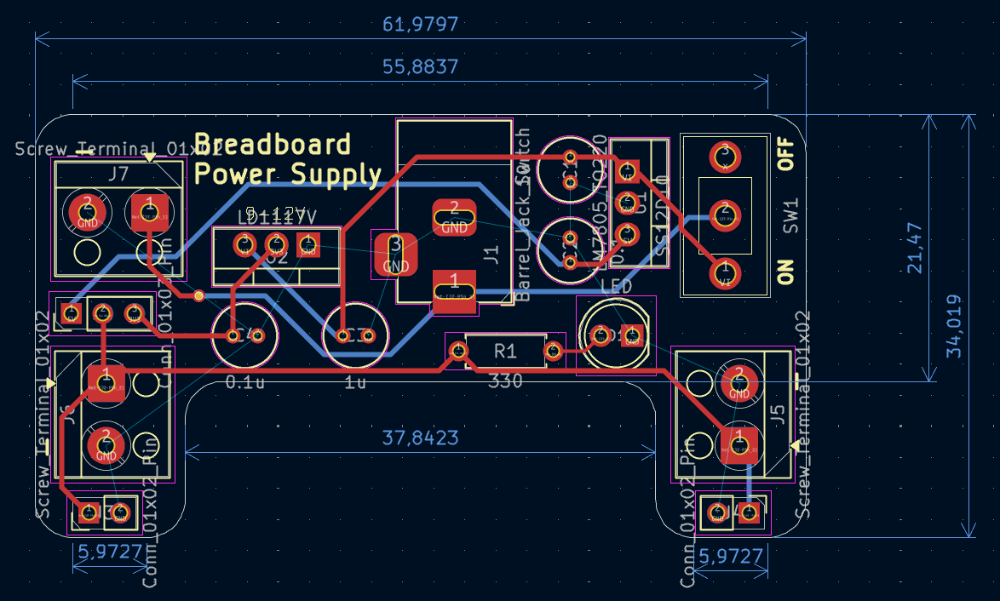
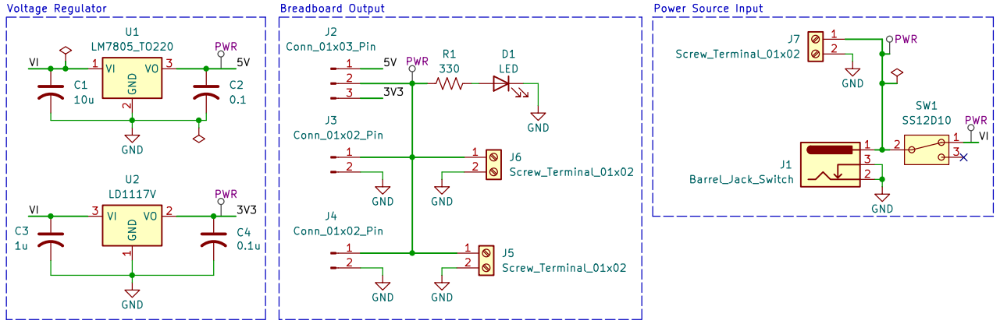

# Breadboard Power Supply
<table>
  <tr>
    <td align="center">
      
       3D View
    </td>
    <td align="center">
      
       PCB View
    </td>
  </tr>
</table>
Breadboard Power Supply with Voltage Regulator

## Description
This project is a simple PCB design using KiCad to provide regulated 5V and 3.3V outputs from an external DC power source (9-12V). The board uses a LM7805 linear regulator to generate 5V and a LD1117V regulator to generate 3.3V. The regulated outputs are available through pin headers and screw terminals, making the board suitable as a compact power module for prototyping on breadboards or external circuits.

## Bill of Materials (BOM)

  

 

| No. | Component                     | Quantity | Description / Value           | Package Type |
|-----|-------------------------------|----------|-------------------------------|--------------|
| 1   | LM7805                        | 1        | 5V Regulator                  | TO-220       |
| 2   | LD1117V                       | 1        | 3.3V Voltage Regulator        | TO-220       |
| 3   | Slide Switch                  | 1        | On/Off switch                 | 3 pin 6x6x5  |
| 4   | Barrel Jack Connector         | 1        | DC input, 9–12 V              | THT          |
| 5   | LED                           | 1        | Power indicator               | 5 mm THT     |
| 6   | Capacitor (Electrolytic)      | 3        | 10uF (1x), 1uF (1x), 0.1uF (1x)   | Radial THT   |
| 7   | Resistor                      | 1        | 330R                          | Axial THT    |
| 8   | 01x02 Pinheader               | 2        | Output to the breadboard      | Male type    |
| 9   | 01x03 Pinheader               | 1        | Output switcher (5 & 3.3V)    | Male type    |
| 10  | 01x02 Screw Connector         | 3        | Input/output terminal         | -            |
